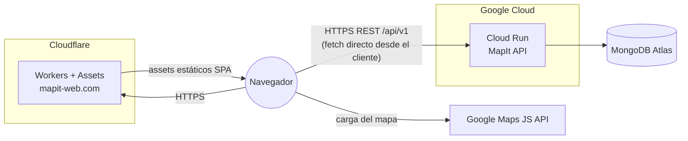

# MapIt WEB


Frontend de **MapIt**, una plataforma de eventos y lugares locales geolocalizados. Angular 22
(standalone components + signals), con Google Maps como elemento central de la interfaz.
Consume la API REST del backend hermano en Spring Boot + MongoDB.

> Proyecto personal de portfolio. El objetivo es una **aplicación mínima pero real y desplegada**
> (mapa interactivo, auth, publicaciones geolocalizadas) sobre la que seguir iterando — no un
> mockup ni un dominio completo desde el primer día. Ver el detalle de qué stack y servicios hay
> detrás en la página **[/stack](https://mapit-web.com/stack)** de la propia app, o en
> [docs/STACK.md](docs/STACK.md).

**Repo hermano (backend Spring Boot):** https://github.com/EMC2-MapItApp/back
**Demo en producción:** https://mapit-web.com

---

## Índice

- [Estado del proyecto](#estado-del-proyecto)
- [Arquitectura](#arquitectura)
- [Stack tecnológico](#stack-tecnológico)
- [Funcionalidad implementada](#funcionalidad-implementada)
- [Puesta en marcha local](#puesta-en-marcha-local)
- [Arquitectura de la app](#arquitectura-de-la-app)
- [Tests](#tests)
- [Despliegue](#despliegue)
- [Documentación adicional](#documentación-adicional)

---

## Estado del proyecto

| Pieza | Estado |
|---|---|
| Mapa interactivo (Google Maps) con publicaciones geolocalizadas | ✅ Completo |
| Auth: login, registro con medidor de fuerza (zxcvbn), verificación de email | ✅ Completo |
| Crear publicación / inscribirse / perfil / ajustes | ✅ Completo |
| Arquitectura responsive (mobile / tablet / desktop) | ✅ Completo |
| Dashboard de gamificación (niveles, XP, capacidades) | 🚧 Deshabilitado en el menú, pendiente del backend |
| Tests unitarios/e2e | 🚧 No implementados todavía (runner Vitest configurado, sin specs reales) |

## Arquitectura



La app se sirve como sitio estático (SPA compilada) desde Cloudflare; no hay servidor Node ni
SSR — todas las llamadas a la API salen directamente desde el navegador del usuario hacia el
backend en Cloud Run.

## Stack tecnológico

Resumen rápido — el detalle completo (por qué cada elección, qué se descartó) está en
**[docs/STACK.md](docs/STACK.md)** y en la página [`/stack`](https://mapit-web.com/stack) de la
propia app.

| Categoría | Tecnología |
|---|---|
| Framework | Angular 22 — standalone components, signals (sin NgModules) |
| UI | Angular Material |
| Mapa | Google Maps JavaScript API (carga del script gestionada a mano en `GoogleMapsService`) |
| Validación de contraseña | `@zxcvbn-ts` — misma escala 0-4 que el `zxcvbn` del backend |
| Capturas de UI | `html2canvas` |
| Tests | Vitest (`@angular/build:unit-test`) |
| Build | Angular CLI / `@angular/build` |
| Hosting | Cloudflare Workers + Assets (SPA estática, sin SSR) |

## Funcionalidad implementada

- **Mapa** (`home/pages/maps`) — vista principal de la app, siempre visible incluso sin sesión.
- **Auth** — login y registro son **diálogos**, no rutas de página propia (se abren sobre el
  shell `HomeShellComponent`); `/verify-email` sí es una página real porque se llega desde fuera de la
  app (enlace del correo).
- **Crear publicación**, **perfil**, **ajustes** — requieren sesión (`authDialogGuard`).
- **Tema claro/oscuro** — `ThemeService`, variables CSS (`--c-*`) en `src/styles/_themes.scss`.
- **Responsive** — mobile/tablet/desktop con una única fuente de verdad
  (`core/responsive/responsive.service.ts`).

## Puesta en marcha local

**Requisitos:** Node según [`.nvmrc`](.nvmrc)/[`.node-version`](.node-version) (24 / ≥22.22.3), y
el [backend](https://github.com/EMC2-MapItApp/back) corriendo en `http://localhost:8081` (perfil
`dev`).

```bash
npm install
npm start        # ng serve → http://localhost:4200, recarga en caliente
npm run build    # ng build de producción (usa environment.prod.ts)
npm run watch    # build incremental en modo development
npm test         # ng test (Vitest)
```

La URL de la API en dev/prod se configura en `src/environments/environment*.ts`
(`apiAuthUrl`, `apiUsersUrl`, `apiCategoriesUrl`, `apiPublicationsUrl`, `apiGeoUrl`).

## Arquitectura de la app

```
src/app/
├── core/       transversal: guards, interceptors, models, servicios de dominio, responsive
├── home/       shell autenticado + páginas (maps, dashboard, profile, settings, create-publication)
├── login/      diálogo de login
├── register/   diálogo de registro
├── verify-email/  página real (no diálogo) para el enlace del correo de verificación
├── stack/      página pública "stack técnico" (portfolio)
└── shared/     componentes reutilizables (diálogos genéricos)
```

**Auth**: JWT en `localStorage` (`TOKEN_KEY`); `authInterceptor` añade
`Authorization: Bearer` a cada petición si hay token. Guards (`auth.guard`, `auth-dialog.guard`,
`load-user-optional`, `load-user.guard`, `open-login-dialog.guard`, `open-register-dialog.guard`)
controlan acceso a rutas y apertura de diálogos.

## Tests

```bash
npm test   # Vitest vía @angular/build:unit-test
```

El runner está configurado pero **no hay specs reales todavía** — es la principal deuda técnica
pendiente de este repo.

## Despliegue

Sitio estático en **Cloudflare Workers + Assets** (no Pages tradicional, no Angular
Universal/SSR). `wrangler.toml` sirve `./dist/mapit-app/browser` como SPA
(`not_found_handling = "single-page-application"`).

## Documentación adicional

- [docs/STACK.md](docs/STACK.md) — stack y servicios en detalle, con el porqué de cada elección
- [CLAUDE.md](CLAUDE.md) — contexto de arquitectura para trabajar en el repo con Claude Code
- [public/llms.txt](public/llms.txt) (servido en [mapit-web.com/llms.txt](https://mapit-web.com/llms.txt)) — punto de entrada estructurado para agentes/LLMs ([convención llms.txt](https://llmstxt.org/))
